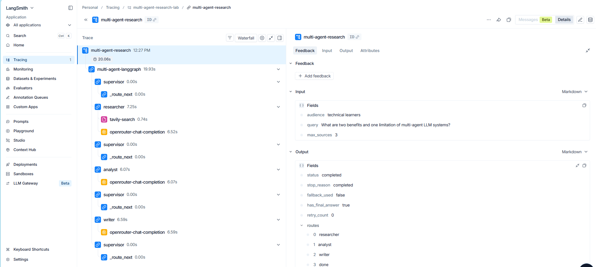

# Evidence LangSmith Trace

Ngày kiểm chứng: **2026-08-20**  
Project: **multi-agent-research-lab**  
Model: **openai/gpt-4o-mini** qua OpenRouter

## 1. Run end-to-end thành công



- Trace ID: `01a01da3-535b-7941-a35c-0d1d401f49ea`
- Query: `What are two benefits and one limitation of multi-agent LLM systems?`
- Status: `completed`
- Route: `researcher -> analyst -> writer -> done`
- Tổng span: 17
- Child span errors: 0
- Search calls: 1
- LLM calls: 3
- Tokens: 5,658 (4,351 input; 1,307 output)
- Estimated cost: `$0.001437`
- Workflow latency: `19.93s`

Cây trace đã được xác minh trên LangSmith:

```text
multi-agent-research
└── multi-agent-langgraph
    ├── supervisor -> _route_next
    ├── researcher
    │   ├── tavily-search
    │   └── openrouter-chat-completion
    ├── supervisor -> _route_next
    ├── analyst -> openrouter-chat-completion
    ├── supervisor -> _route_next
    ├── writer -> openrouter-chat-completion
    └── supervisor -> _route_next
```

Screenshot ở trên được chụp từ run đã xác minh và được giữ làm evidence nộp bài. Trace chỉ chứa dữ liệu cần thiết cho quan sát; API key/authorization header không được đưa vào metadata.

## 2. Failure path đã quan sát

- Trace ID: `01a01da2-6d52-7943-ac89-9e04758a091e`
- Workflow status: `failed`
- Route: `researcher -> analyst -> writer -> writer -> done`
- Retry: 1 lần ở Writer
- Failure mode: Writer liệt kê citation label không đúng và có URL của nguồn không được cite.
- Kết quả: trace vẫn ghi đủ 21 span, gồm cả hai lần Writer; citation guardrail dừng workflow thay vì trả final answer không hợp lệ.

Failure trace này chứng minh retry + validation thực sự chạy trong end-to-end workflow.

## 3. Failure evidence từ final benchmark

Benchmark online/offline tiếp tục ghi nhận các failure class thực tế:

- `timeout` — workflow nhiều sequential call có thể chạm timeout.
- `writer_failed` — Writer vi phạm strict Sources/citation contract sau retry.
- `critic_failed` — Critic trả structured decision không hợp lệ, ví dụ chọn `revise` nhưng thiếu issue actionable.

Các failure không bị lọc khỏi benchmark; chúng được tính vào failure rate để phản ánh reliability thực tế.

## 4. Tracing fail-open

Trong final benchmark có một số lần LangSmith URL lookup không khả dụng (`LangSmithNotFoundError`) nhưng workflow vẫn hoàn thành. Đây là hành vi mong muốn: tracing là observability layer và không được trở thành single point of failure của research workflow.
